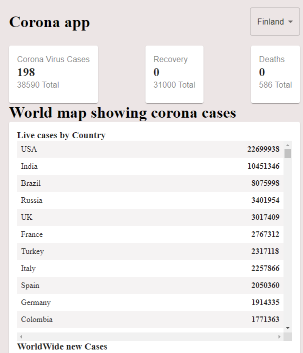
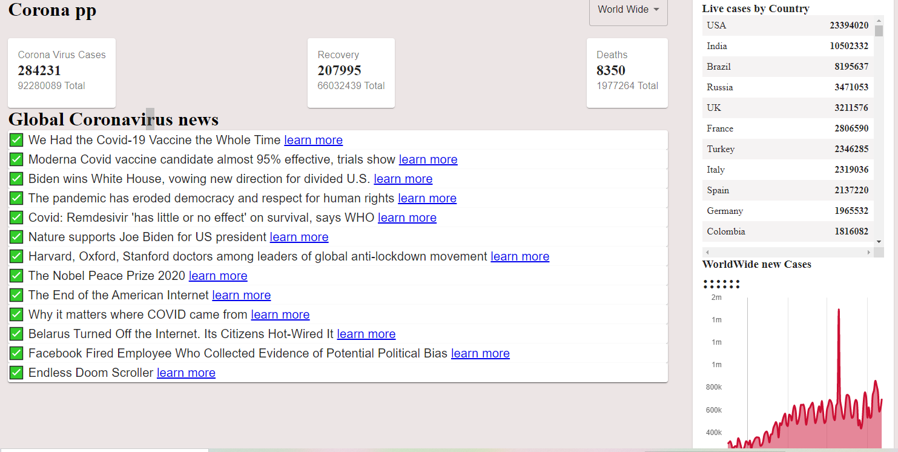

# Corona (Covid-19) Tracking application
## Corona App
### This project was bootstrapped with [Create React App].

### Description
This is a simple starter project for React with its dependacies.

Features:

    1. React
    2. MaterialUI
    3. Apis ()
    4. Axios
    5. graph.js
    6. numeral

System Requirements

1. Globally installed node >= 6.0
2. Globally/locally  installed;
   
     1. axios >= ^0.21.1
     2. react  >=  16.13.1
     3. react-dom  >=  16.13.1
     4. react-scripts  >=  3.4.1
     5. materilal@ui >= 4.11.1
     6. numeral  >=  2.0.6
     7. chart.js   >= 2.9.4

<h1>An intergration of React, MaterialUI and dependacy frameworks to produce one of my best work (atleast with React)  so far</h>